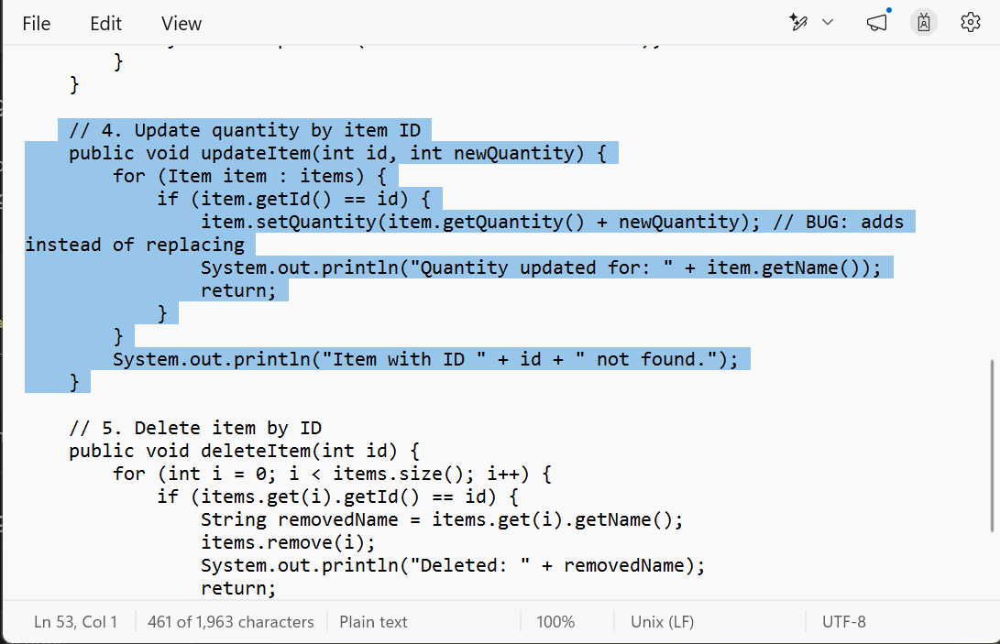
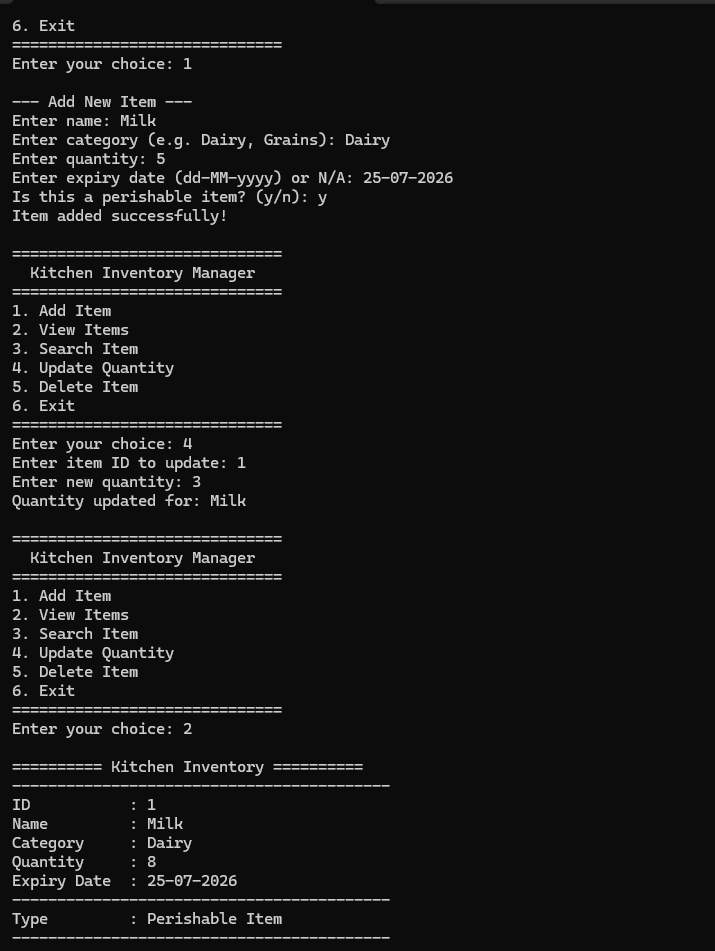
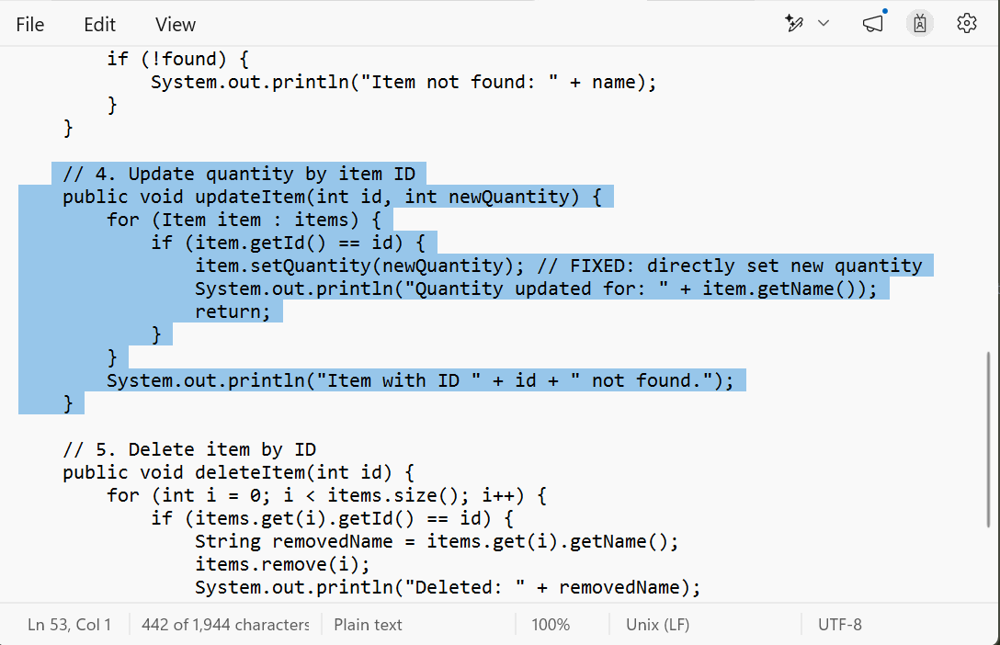
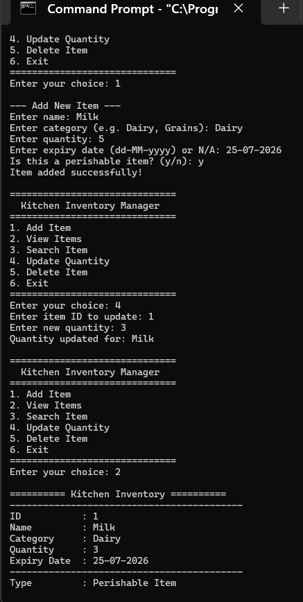

# Debugging Report

## Project Name
Kitchen Inventory Manager

## Purpose
This report documents a bug that was intentionally introduced into the project
to demonstrate the debugging process as part of the OOP assignment requirement.

---

## Bug Description

When the user selects **Option 4 – Update Quantity** and enters a new quantity
value, the program incorrectly **adds** the entered value to the existing
quantity instead of **replacing** it with the new value.

---

## Expected Result

If an item (e.g. Milk) has a current quantity of **5** and the user enters
**3** as the new quantity, the quantity should become **3**.

---

## Actual Result (With Bug)

The quantity becomes **8** (5 + 3) because the buggy code adds the new value
on top of the old one.

---

## Root Cause

The bug is in `Inventory.java` inside the `updateItem()` method.

**Buggy Code:**
```java
public void updateItem(int id, int newQuantity) {
    for (Item item : items) {
        if (item.getId() == id) {
            item.setQuantity(item.getQuantity() + newQuantity);  // BUG
        }
    }
}
```

The expression `item.getQuantity() + newQuantity` retrieves the existing
quantity (5) and adds the user's input (3) to it, resulting in 8 instead of 3.

---

## Debugging Steps

### Step 1 – Identify the Bug in Code

Opened `Inventory.java` in a text editor and located the `updateItem()` method.

The buggy line was:
```java
item.setQuantity(item.getQuantity() + newQuantity); // BUG: adds instead of replacing
```

**Screenshot 1 – Buggy code highlighted in editor:**



---

### Step 2 – Run the Buggy Program and Observe Wrong Output

Compiled and ran the program from Command Prompt:
```
javac src\Item.java src\PerishableItem.java src\Inventory.java src\Main.java
java src.Main
```

Test steps performed:
1. Selected Option 1 (Add Item) → Added Milk with quantity **5**
2. Selected Option 4 (Update Quantity) → Entered ID: 1, New quantity: **3**
3. Selected Option 2 (View Items) → Observed quantity was **8** (WRONG)

**Screenshot 2 – CMD output showing wrong quantity (8 instead of 3):**



---

### Step 3 – Fix the Bug

Changed the buggy line in `Inventory.java` from:
```java
item.setQuantity(item.getQuantity() + newQuantity); // BUG
```
to:
```java
item.setQuantity(newQuantity); // FIXED: directly set new quantity
```

**Screenshot 3 – Fixed code highlighted in editor:**



---

### Step 4 – Run the Fixed Program and Verify Correct Output

Recompiled and ran the program again:
```
javac src\Item.java src\PerishableItem.java src\Inventory.java src\Main.java
java src.Main
```

Performed the same test steps:
1. Selected Option 1 (Add Item) → Added Milk with quantity **5**
2. Selected Option 4 (Update Quantity) → Entered ID: 1, New quantity: **3**
3. Selected Option 2 (View Items) → Observed quantity was **3** (CORRECT)

**Screenshot 4 – CMD output showing correct quantity (3):**



---

## Observations

- The bug does not produce any compile error or runtime exception.
- The program runs normally and prints "Quantity updated for: Milk".
- The wrong result is only visible when viewing the item afterwards.
- This type of bug is called a **Logic Error** — the code is syntactically
  correct but produces the wrong output.

---

## Final Fix

**Before (Buggy):**
```java
item.setQuantity(item.getQuantity() + newQuantity);
```

**After (Fixed):**
```java
item.setQuantity(newQuantity);
```

---

## Lessons Learned

1. Logic errors do not cause compile or runtime errors — they silently
   produce wrong results and are harder to find than syntax errors.

2. Testing the program with known inputs and verifying the output is
   the most effective way to catch logic errors.

3. Always verify that an "update" operation replaces the value, not adds to it.

4. Reading the code line by line and tracing the variable values manually
   helps identify where the logic goes wrong.
